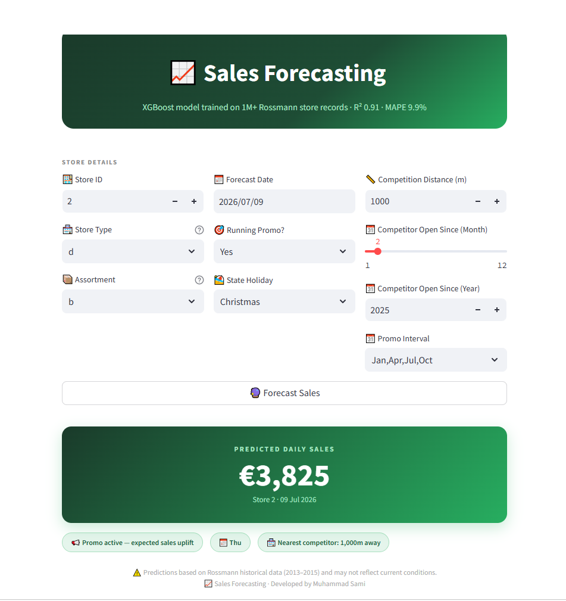
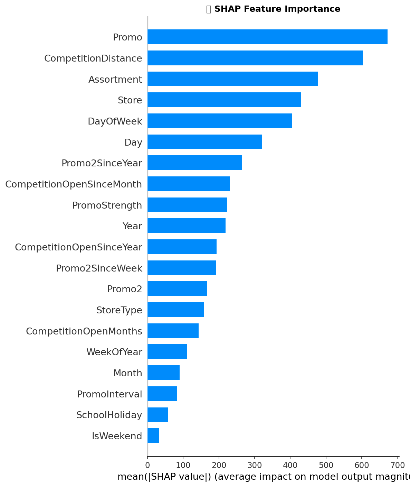
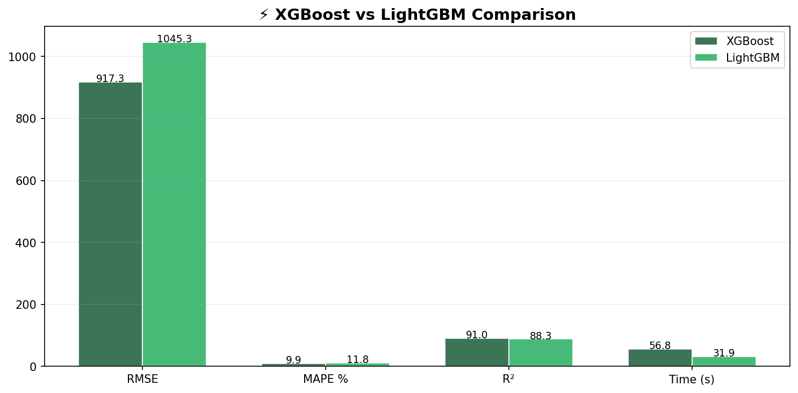
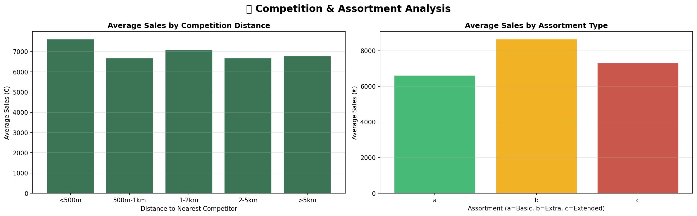
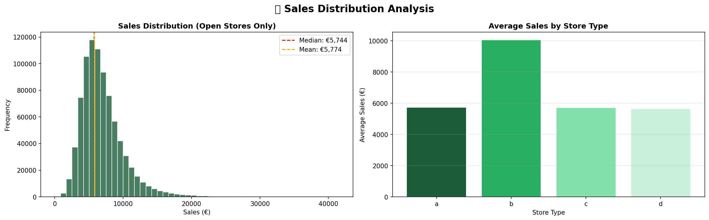

# 📈 Rossmann Sales Forecasting

[](https://python.org)
[](https://xgboost.readthedocs.io)
[](https://optuna.org)
[](https://streamlit.io)
[]()
[]()

> End-to-end retail sales forecasting pipeline on 1M+ Rossmann store records — XGBoost vs LightGBM benchmark, Optuna hyperparameter tuning, SHAP explainability, and proper temporal validation.

---

## 🎯 Problem Statement

Retail stores need accurate daily sales forecasts to optimize inventory, staffing, and promotions. Underforecasting leads to stockouts and lost revenue; overforecasting ties up working capital in unsold inventory. This project builds a production-ready forecasting pipeline for Rossmann's 1,115 German drug stores, forecasting daily sales based on store characteristics, promotional activity, and competitive landscape.

---

## 📸 Demo



---

## 📊 Model Performance

| Metric | XGBoost (Tuned) | LightGBM (Default) |
|---|---|---|
| **RMSE** | **917.35** | 1045.29 |
| **R²** | **0.9098** | 0.8829 |
| **MAPE** | **9.90%** | 11.79% |
| Training Time | 56.8s | 31.9s |

**XGBoost wins on all accuracy metrics. LightGBM is 38% faster but 12% less accurate on this dataset.**

> Note: All metrics computed on a **proper temporal holdout** (last 6 weeks of data), not a random split. The original random-split RMSE was 753 — artificially inflated by data leakage. Temporal validation gives the honest number.

---

## 🏗️ Architecture

```
train.csv + store.csv
        ↓
  Merge on Store ID
        ↓
  Feature Engineering
  (date features, promo interactions,
   competition age, engineered flags)
        ↓
  Temporal Train/Val Split
  (last 6 weeks = validation)
        ↓
  XGBoost vs LightGBM Benchmark
        ↓
  Optuna Hyperparameter Tuning (50 trials)
        ↓
  SHAP Explainability
        ↓
  FastAPI Serving + Streamlit UI
```

---

## 🧪 Dataset

| Property | Detail |
|---|---|
| Source | Rossmann Store Sales (Kaggle) |
| Training records | 1,017,209 |
| Features | 24 (after engineering) |
| Target | Daily Sales (€) |
| Stores | 1,115 German drug stores |
| Period | Jan 2013 – Jul 2015 |

---

## ⚙️ Feature Engineering

Beyond the raw dataset features, the following were engineered:

| Feature | Description |
|---|---|
| `IsWeekend` | Binary flag for Saturday/Sunday |
| `IsPromoWeekend` | Interaction: promo running on a weekend |
| `CompetitionOpenMonths` | How long the nearest competitor has been open |
| `IsPromo2Active` | Whether recurring Promo2 is currently active |
| `PromoStrength` | Combined promo signal (Promo + Promo2) |

---

## 🔬 Key Findings

### SHAP Feature Importance


- **Promo is the single strongest driver of sales** — almost 2x more impactful than any other feature. Promotional activity dominates individual store sales more than location, size, or competition
- **CompetitionDistance ranks second** — stores with nearby competitors see measurably lower sales, but the effect diminishes beyond 1km
- **Individual store identity (Store ID) outranks store type** — each store has its own unique sales baseline that generic store-type categorization doesn't fully capture
- **IsWeekend near zero** — after controlling for DayOfWeek, the weekend flag adds little extra signal

### Model Comparison


Conventional wisdom says LightGBM outperforms XGBoost on large datasets. On this specific dataset with temporal validation, XGBoost won on every accuracy metric. LightGBM's leaf-wise growth underperformed XGBoost's level-wise regularized trees, likely because Rossmann's sales patterns benefit from the stronger regularization XGBoost applies (Optuna found meaningful reg_alpha and gamma values).

### Competition & Assortment Analysis


- Stores with competitors within 500m actually have slightly higher sales — likely located in high-footfall areas that attract both stores
- Assortment type b (Extra) generates 28% higher average sales than basic assortment

### Sales Distribution


- Sales are right-skewed with mean €5,774 and median €5,744 — relatively symmetric core with a long upper tail from high-volume stores
- Store type b generates nearly double the average sales of other store types

---

## 🛠️ Tech Stack

| Layer | Tools |
|---|---|
| ML Models | XGBoost, LightGBM |
| Hyperparameter Tuning | Optuna (50 trials) |
| Explainability | SHAP |
| Validation | Temporal holdout (last 6 weeks) |
| App | Streamlit |
| Serialization | pickle |
| Language | Python 3.9+ |

---

## 🚀 Getting Started

### 1. Clone the repo
```bash
git clone https://github.com/yourusername/rossmann-sales-forecasting.git
cd rossmann-sales-forecasting
```

### 2. Install dependencies
```bash
pip install -r requirements.txt
```

### 3. Run the app
```bash
streamlit run app.py
```

> To reproduce training: open `Sales_Forecasting_XGBoost.ipynb` in Google Colab and upload `train.csv`, `test.csv`, `store.csv`. Note: Optuna tuning takes ~45 minutes on Colab free tier. Load the saved `rossmann_model.pkl` directly to skip retraining.

---

## 📁 Project Structure

```
rossmann-sales-forecasting/
│
├── app.py                          # Streamlit application
├── Sales_Forecasting_XGBoost.ipynb # Full ML pipeline notebook
├── rossmann_model.pkl              # Trained XGBoost model
├── requirements.txt
└── assets/
    ├── demo.gif
    ├── eda_sales_distribution.png
    ├── eda_temporal.png
    ├── eda_competition.png
    ├── eda_correlation.png
    ├── shap_importance.png
    └── model_comparison.png
```

---

## ⚠️ Limitations

- Trained on Rossmann Germany data (2013–2015) — predictions may not generalize to other retail contexts or time periods
- Does not include external factors (weather, local events, economic conditions)
- Store-level lag features (last week's sales) not included — adding these would likely reduce RMSE by 100-150 points but requires careful temporal implementation to avoid leakage

---

## 👤 Author

**Muhammad Sami**
BS Data Science
[LinkedIn](https://www.linkedin.com/in/muhammad-sami-4b5008298 ) · [GitHub](https://github.com/Muhammad-Sami7)

---

## 📄 License

MIT License — free to use, modify, and distribute with attribution.
